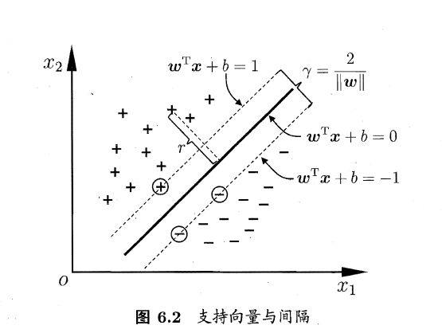

### 支持向量机 ——周志华西瓜书 笔记

1.  间隔与支持向量

   给点训练样本集$D=\{(x_1, y_2, ..., (x_m, y_m))\}, y\in \{-1, +1\}$， 分类学习最基本的想法就是基于训练集$D$在样本空间中找到一个划分超平面，将不同类别的样本分开。需要划分超平面对训练样本局部扰动的“容忍”性最好，最鲁棒的， 对未见示例的泛化能力 最强。

   ​    在样本空间中， 划分超平面可通过如下线性方程来描述：
   $$
   w^Tx+b=0 \tag{1}
   $$
   其中$w=(w_1, w_2, ...;w_d)$为法向量， 决定了超平面的方向， $b$为位移项， 决定了超平面与原点之间的距离。
   $$
   r=\frac{|w^Tx+b|}{||w||}\tag{2}
   $$
   ​	假设超平面$(w,b)$能将训练样本正确分类，即对于$(x_i, y_i) \in D$， 若$y_i = +1$, 则有$w^Tx_i +b> 0$; 若$y_i = -1$, 则有$w^Tx_i +b < 0$， 令
   $$
   w^Tx_i +b \geq +1, y_i=+1;\\
   w^Tx_i +b \leq -1, y_i = -1 \tag{3}
   $$
   如下图所示，距离超平面最近的几个训练样本点使式（3）的等号成立， 他们被称为“支持向量”， 两个异类支持向量到超平面的距离之和为
   $$
   \gamma = \frac{2}{||w||} \tag{4}
   $$
   它被称为“间隔”

​					欲找到具有"最大间隔"的划分超平面，也就是要找到满足式（3）中约束的参数$w$和b， 使得$\gamma  $最大， 即
$$
max_{w, b}\frac{2}{||w||} \\
s.t.\ \  y_i(w^Tx_i+b)\geq 1,\  i =1,2,...,m.\tag{5}
$$
​					显然，为了最大化间隔， 仅需最大化$||w||^{-1}$, 这等价于最小化$||w||^2$, 于是上式可重写为
$$
min_{w, b} \frac{1}{2} ||w||^2\\
s.t. \ y_i(w^Tx_i +b) \geq 1, \ \ i=1, 2, ...,m\tag{6}
$$
​					**这就是支持向量机（Support Vector Machine , 简称SVM）**的基本型。

2. 对偶问题

   最大间隔划分超平面所对应的模型为：
   $$
   f(x) = w^Tx +b \tag{7}
   $$
   其中$w$和$b$是模型参数， 注意到式（6）本身是一个凸二次规划问题， 能直接用现成的优化计算包求解， 到我们可以有更高效的方法。

   ​	对式（6）使用拉格朗日乘子法可得到其"对偶问题"。具体来说， 对式（6）的每条约束添加拉格朗日乘子$\alpha_i \geq 0$, 则该问题的拉个朗日函数可写为： 
   $$
   L(w, b, \alpha) = \frac{1}{2}||w||^2+ \sum_{i=1}^m \alpha_i(1- y_i(w^Tx_i+b)) \tag{8}
   $$
   其中$\alpha = (\alpha_1; \alpha_2;...;\alpha_m)$, 令$L(w, b ,\alpha)$对$w$和$b$的偏导为零可得：
   $$
   w=
   $$
   