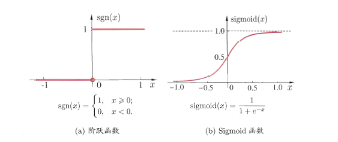

## 神经网络——周志华西瓜书笔记

1. 神经元模型

   ​	神经网络中最基本的成分是神经模型，即“简单”单元。现在一直沿用的是“**M-P神经元模型**“，在这个模型中， 神经元接收到来自$n$个其他神经元传递过来的输入信号， 这些输入信号通过带权重的连接进行传递， 神经元接收到的中输入值与神经元的阈值进行比较，然后通过**激活函数**处理产生神经元的输出。

   ​	理想的激活函数是 **阶跃函数**， 但是由于阶跃函数 **不连续、不光滑**的性质，  因此实际常用 **Sigmoid** 函数作为 激活 函数。

2. 感知机和多层网络

   ​	感知机由两层神经元组成， 输入层接收外界信号后传递给输出层， 输出层是 **M-P**神经元， 也称“**阈值逻辑单元**”。

   ​	感知机容易地实现逻辑与、或、非运算。注意到$y=f(\sum_i w_ix_i -\theta)$,假设$f$是上图中的阶跃函数，有：

   - ”与“：令$w_1= w_2 = 1 , \theta=2$，则$y=f(1*x_1+1*x_2 -2)$, 仅当$x_1=x_2=1$时， $y=1$;
   - “或”：令$w_1= w_2 = 1 , \theta=0.5$, 则$y=f(1*x_1+1*x_2 -0.5)$仅当$x_1=1$或$x_2=1$时， $y=1$;
   - “非”：令$w_1=0.6， \  w_2 = 0 , \theta=-0.5$，则$y=f(-0.6*x_1+0*x_2 +0.5)$, 仅当$x_1=1$时，$y=0$；$x_2=0$时， $y=1$;

   感知机学习规则非常简单， 对训练样例$(x, y)$, 若当前感知机的输出为$\hat{y}$, 则感知机权重将这样调整：
   $$
   w_i \gets w_i+\Delta w_i \tag{1}
   $$

   $$
   \Delta w_i = \eta(y - \hat{y})x_i\tag{2}
   $$

   感知机只有输出层神经元进行激活函数处理， 即只拥有一层功能神经元， 其学习能力非常有限。例如在非线性可分问题上。这时就需要考虑使用多层功能神经元。如下图简单的量程感知机就能解决异或问题：

   

   如上图中输入层与输出层之间的神经元， 称为 **隐层或隐含层**， 隐含层和输出层神经元都是拥有激活函数的功能神经元。常见的神经网络是每层神经元与下一层神经元全互连， 神经元之间不存在同层连接， 也不存在跨层连接——**多层前馈神经网络**。其中输入层神经元接收外界输入（仅接收数据），隐层与输出层神经元对信号进行加工， 最终结果由由输出层神经元输出。神经网络的学习过程， 就是根据训练数据来调整神经元之间的“**连接权**”以及每个功能神经元的**阈值**。

3. 误差逆传播算法

   ​	误差逆传播算法（Error BackPropagation 也称 反向传播算法 简称：BP）是最杰出的学习算法。通常说的“**BP网络**”指用BP算法训练的多层前馈神经网络。

   ​	给定训练集$D=\{(x_1, y_1), (x_2, y_2), ..., (x_m, y_m)\},\  x \in \R^d, \  y_i\in \R^l$, 即输入示例由$d$个属性描述， 输出的$l$维实值向量。下图给出了一个拥有$d$个输出神经元， $l$个输出神经元， $q$个隐层神经元的多层前馈神经网络 结构，其中输出层第$j$个神经元的阈值用$\theta_j$表示， 隐含层的第$h$个神经元的阈值用$\gamma_h$表示，输入层第$i$个神经元与隐层第$h$个神经元直接的连接权威$v_{ih}$， 隐层第$h$个神经元与输出层第$j$个神经元直接的连接权$w_{hj}$，记隐层第$h$个神经元接收到的输入为$\alpha_h = \sum_{i=1}^d v_{ih}x_i$, 其中输出层第$j$个神经元接收到的输入为$\beta_j =\sum_{h=1}^q w_{hj}b_h$， 其中$b_n$为隐层第$h$个神经元的输出。假设隐含层和输出层神经元都使用 **Sigmoid**函数。

   

   对于训练集$(x_k, y_k)$, 假定神经网络的输出为$\hat{y}_k=(\hat{y}_1^k, \hat{y}_2^k, ..., \hat{y}_l^k)$,即
   $$
   \hat{y}_j^k = f(\beta_j - \theta _j ), \tag{3}
   $$
   则网络在$(x_k, y_k)$上的均方差误差为：
   $$
   E_k = \frac{1}{2}\sum_{j=1}^l (\hat{y}_j^k - y_j^k)^2 \tag{4}
   $$
   ​	上图中的网络有$(d+l+1)*q+l$个参数需要确定： 输入层到隐层的$d\times q$个权值、隐层到输出层的$q \times l$个权值， $q$个隐层神经元的阈值， $l$个输出层神经元的阈值。**BP**是一个迭代的学习算法， 在迭代的每一轮中才用广义的感知学习规则对参数进行更新估计。任意参数$v$的更新估计式为：
   $$
   v \gets v+\Delta v \tag{5}
   $$
   **BP**算法基于梯度下降策略， 以目标的负梯度方向对参数进行调整。对式（4）的误差$E_k$, 给定学习率：$\eta$, 有
   $$
   \Delta w_{hj} = -\eta \frac{\partial E_k}{\partial w_hj}\tag{6}
   $$
   注意到$w_{hj}$先影响到第$j$个输出层神经元的输入值$\beta _j$, 再影响到其输出值$\hat{y}_j^k$, 然后影响到$E_k$, 有：
   $$
   \frac{\partial E_k}{\partial w_{hj}}= \frac{ \partial E_k}{\partial \hat{y}_j^k} \cdot \frac{\partial \hat{y}_j^k}{\partial \beta_j} \cdot \frac{\partial \beta_j}{\partial w_{hj}} \tag{7}
   $$
   根据$\beta_j$的定义， 显然有
   $$
   \frac{\partial \beta_j}{\partial w_{hj}}= b_h \tag{8}
   $$
   

​	